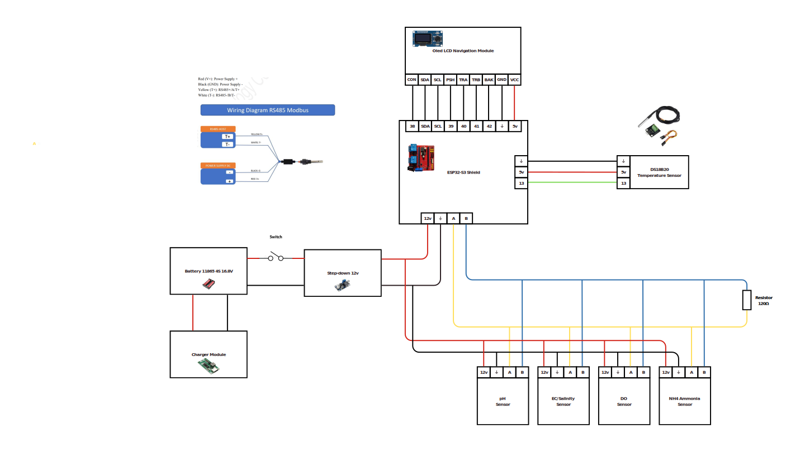

---

# 💧 **Aquanotes | Industrial Water Quality Monitor**

> **Professional multi-sensor system for precise and reliable water quality monitoring — with OLED display, modular architecture, and cloud connectivity.**

---

## ⚙️ **Key Features**

* 🌊 **Multi-Sensor Support** — pH, Dissolved Oxygen, Conductivity/TDS, Ammonia, and Temperature
* 🖥️ **User Interface** — 1.3" OLED Display + Rotary Encoder & Buttons
* ☁️ **Wireless Connectivity** — WiFi-enabled with Cloud Data Logging
* 📈 **Real-Time Monitoring** — Continuous readings with live display
* 🧪 **Built-in Calibration System** — On-device calibration for all sensors
* 🧩 **Modular Firmware** — Clean, maintainable, and extensible codebase

---

## 🧰 **Hardware Requirements**

| Component              | Description                                            |
| ---------------------- | ------------------------------------------------------ |
| **MCU**                | ESP32-S3 Development Board                             |
| **Display & Input**    | 1.3" OLED (SH1106) + EC11 Rotary Encoder               |
| **Sensors (RS485)**    | pH (S-pH-01), Dissolved Oxygen (S-RJY-01), EC/TDS, NH4 |
| **Temperature Sensor** | DS18B20                                                |
| **RS485 Driver**       | SP3485 Transceiver                                     |
| **Power Supply**       | 12–24V DC                                              |

---

## 🔌 **Pin Configuration**

| Component   | ESP32-S3 Pin |
| ----------- | ------------ |
| RS485 RX    | GPIO 16      |
| RS485 TX    | GPIO 15      |
| RS485 DE/RE | GPIO 14      |
| DS18B20     | GPIO 13      |
| OLED SDA    | GPIO 21      |
| OLED SCL    | GPIO 22      |
| Encoder CLK | GPIO 39      |
| Encoder DT  | GPIO 40      |
| Encoder SW  | GPIO 41      |
| Button A    | GPIO 42      |
| Button B    | GPIO 43      |

---

## 🖼️ **Wiring Diagram**

Visual overview of the hardware connections:

<p align="center">
  
</p>

---

## 🚀 **Installation Guide**

1. Install [PlatformIO](https://platformio.org/)
2. Clone this repository
3. Connect hardware following the **Pin Configuration** above
4. Build and upload firmware to **ESP32-S3**
5. Configure WiFi via device’s **Setup Menu**

---

## 🎛️ **Menu Navigation**

| Control            | Function           |
| ------------------ | ------------------ |
| **Encoder Rotate** | Navigate Up / Down |
| **Encoder Button** | Select / Confirm   |
| **Button A**       | Action / Refresh   |
| **Button B**       | Back / Cancel      |

---

## 📏 **Sensor Specifications**

| Sensor                    | Range           | Accuracy |
| ------------------------- | --------------- | -------- |
| **pH**                    | 0–14            | ±0.1     |
| **Dissolved Oxygen**      | 0–20 mg/L       | ±2%      |
| **Conductivity (EC/TDS)** | 0–20,000 µS/cm  | ±3%      |
| **Temperature**           | -55°C to +125°C | ±0.5°C   |
| **Ammonia (NH₄)**         | 0–1000 ppm      | —        |

---

## 🔧 **Calibration**

Supported calibration modes:

* **pH** — 3-point (4.01, 7.00, 10.01)
* **Dissolved Oxygen** — Zero & Slope
* **Conductivity** — 1413 µS/cm & 12880 µS/cm

---

## 🌐 **Data Format (Cloud Payload)**

Data is sent in JSON format:

```json
{
  "uid": "AER2023AQ0015",
  "suhu": 25.5,
  "ph": 7.25,
  "do": 8.45,
  "tds": 725,
  "ammonia": 0.254,
  "salinitas": 798,
  "timestamp": "2024-01-01 12:00:00"
}
```

---

## 🧠 **Summary**

Aquanotes combines industrial-grade sensors, modular firmware, and cloud-based monitoring to deliver **reliable, scalable, and user-friendly** water quality measurement for modern IoT environments.

---